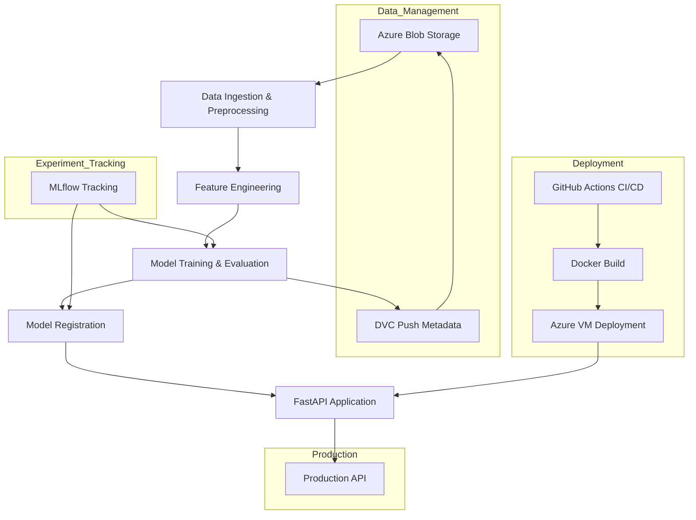
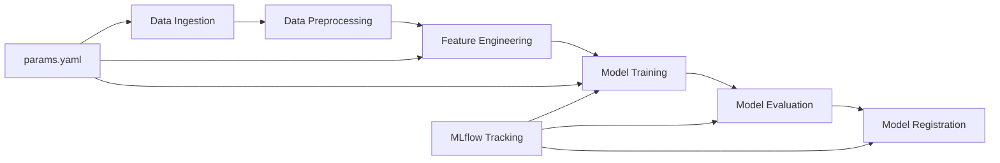

# Sentiment Analysis - End to End ML Model

[](https://python.org)
[](https://fastapi.tiangolo.com/)
[](https://mlflow.org/)
[](https://dvc.org/)
[](https://docker.com/)
[](https://azure.microsoft.com/)

> **Production-level sentiment analysis system** with comprehensive MLOps pipeline featuring experiment tracking, data versioning, automated CI/CD, and cloud deployment.

## Project Overview

This project implements a **scalable sentiment analysis solution** using multiple machine learning algorithms with comprehensive MLOps practices. The system processes text data to classify sentiment as positive or negative, featuring automated model comparison, experiment tracking, and production deployment.

### Key Highlights

- **10 Different Model Configurations** tested and compared
- **82.5% Best Accuracy** achieved with Logistic Regression + TF-IDF
- **80,000 Training Samples** with balanced dataset
- **Real-time API** for sentiment prediction
- **Complete MLOps Pipeline** with automated deployment

## Model Performance Results


| Algorithm | Vectorizer | Accuracy | Precision | Recall | F1-Score |
|---|---|---:|---:|---:|---:|
| GradientBoosting | TF‑IDF | 0.728  | 0.765  | 0.653  | 0.705  |
| GradientBoosting | BoW | 0.721  | 0.805  | 0.577  | 0.672  |
| RandomForest | TF‑IDF | 0.819  | 0.806  | 0.835  | 0.820  |
| RandomForest | BoW | 0.821  | 0.812  | 0.831 | 0.821  |
| XGBoost | TF‑IDF | 0.790  | 0.815  | 0.746  | 0.779  |
| XGBoost | BoW | 0.791  | 0.832  | 0.724  | 0.774  |
| MultinomialNB | TF‑IDF | 0.786  | 0.774  | 0.803  | 0.788  |
| MultinomialNB | BoW | 0.743 | 0.717 | 0.798  | 0.755  |
| LogisticRegression | TF‑IDF | 0.8276  | 0.8318  | 0.8177  | 0.8247  |
| LogisticRegression | BoW | 0.805  | 0.816  | 0.784  | 0.800  |

##  Dataset Information

-This dataset combines sentiment-labeled data from four domains:
    -Movie reviews (e.g., IMDB)(20k samples)
    -Twitter sentiment (e.g., Sentiment140)(20k samples)
    -ChatGPT-generated sentiment data(20k samples)
    -Amazon product reviews(20k samples)

| Metric | Value |
|--------|--------|
| **Dataset Size** | 80,000 samples |
| **Features** | 2 columns (sentiment, text) |
| **Target Distribution** | Balanced (40,000 positive, 40,000 negative) |
| **Vocabulary Size** | 98,143 unique words after preprocessing |
| **Train-Test Split** | 80%-20% |
| **Missing Values** | None |

##  Project Architecture



##  Project Structure

```
sentiment-analysis/
├── data/                        # DVC-tracked datasets
├── notebooks/                   # Jupyter experiments
│   ├── exp1.ipynb               # Baseline model
│   ├── exp2_bow_vs_tfidf.py     # Vectorizer comparison
│   ├── exp3_lr_with_diff_vectorizer.py
│   ├── exp4_lr_tfidf_hp.py      # Hyperparameter tuning
│   └── balanced_sentiment_dataset.csv
├── src/                         # Source code modules
│   ├── data/                    # Data processing
│   │   ├── data_ingestion.py
│   │   └── data_preprocessing.py
│   ├── features/                # Feature engineering
│   │   └── feature_engineering.py
│   ├── model/                   # Model training & evaluation
│   │   ├── model_building.py
│   │   ├── model_evaluation.py
│   │   └── register_model.py
│   └── logger/                  # Logging utilities
├── fastapi_app/                 # Production API
│   ├── app.py                   # FastAPI application
│   ├── templates/               # HTML templates
│   └── requirements.txt
├── tests/                       # Unit & integration tests
├── reports/                     # Model reports & metrics
│   └── figures/                 # UI screenshots
├── Configuration Files
│   ├── dvc.yaml                 # DVC pipeline
│   ├── params.yaml              # Parameters
│   ├── requirements.txt         # Dependencies
│   └── Dockerfile               # Container setup
└── CI/CD
    └── .github/workflows
                  ├── ci.yaml       
                  └── cd.yaml  

```

##  Tech Stack & Tools

### **Machine Learning**
- **Algorithms**: Logistic Regression, MultinomialNB, XGBoost, Random Forest, Gradient Boosting
- **Vectorization**: TF-IDF, Bag of Words (CountVectorizer)
- **Preprocessing**: NLTK (stopwords, lemmatization), Custom text cleaning

### **MLOps & Experiment Tracking**
- **MLflow**: Experiment tracking, model registry, artifact storage
- **DagsHub**: Centralized ML collaboration platform
- **DVC**: Data and model versioning with Azure Blob Storage

### **API & Deployment**
- **FastAPI**: High-performance web API framework
- **Docker**: Containerization for reproducible deployments
- **Azure VM**: Cloud deployment infrastructure

### **Development & CI/CD**
- **GitHub Actions**: Automated testing and deployment
- **Pytest**: Unit and integration testing
- **Azure CLI**: Cloud resource management

##  Quick Start

### Prerequisites
```bash
# Required tools
Python 3.10+
Git
Docker (optional)
Azure CLI (for cloud deployment)
```

### 1. Clone & Setup
```bash
git clone https://github.com/rohitkr8527/sentiment-analysis.git
cd sentiment-analysis

# Create virtual environment
python -m venv venv
source venv/bin/activate  # Linux/macOS
# venv\Scripts\activate   # Windows

# Install dependencies
pip install -r requirements.txt
```

### 2. Data Pipeline (DVC)
```bash
# Initialize DVC
dvc init

# Add local remote for development
mkdir local_blob
dvc remote add -d mylocal local_blob

# For production: Configure Azure Blob Storage
pip install "dvc[azure]" azure-cli
az login
dvc remote add -d myremote azure://<container-name>

# Run complete pipeline
dvc repro
dvc status
dvc push  # Push to remote storage
```

### 3. Experiment Tracking (MLflow + DagsHub)
```bash
# Install MLflow and DagsHub
pip install "mlflow<3" dagshub

# Set credentials (use environment variables)
export DAGSHUB_TOKEN="your_token_here"

# Run experiments
python notebooks/exp2_bow_vs_tfidf.py
jupyter notebook notebooks/exp1.ipynb
```

### 4. FastAPI Application
```bash
cd fastapi_app
pip install fastapi uvicorn

# Set environment variables
export sentiment_analysis="your_dagshub_token"

# Run locally
uvicorn app:app --reload --host 0.0.0.0 --port 8000

# Access API
# http://localhost:8000 - Web Interface
# http://localhost:8000/docs - API Documentation
# http://localhost:8000/metrics - Prometheus metrics
```

### 5. Docker Deployment
```bash
# Build image
docker build -t sentiment-app:latest .

# Run container
docker run -p 8000:8000 \
  -e sentiment_analysis="your_token" \
  sentiment-app:latest
```

##  API Usage

### Web Interface
The FastAPI application provides a user-friendly web interface for sentiment prediction:

**Prediction Interface:**
- Navigate to `http://localhost:8000`
- Enter text in the input field
- Click "Predict" to get sentiment classification
- Results show: Positive (1) or Negative (0)

### REST API Endpoints

```python
# Example API usage
import requests

# Health check
response = requests.get("http://localhost:8000/")

# Predict sentiment
data = {"text": "I love this product! It's amazing!"}
response = requests.post("http://localhost:8000/predict", data=data)
prediction = response.json()["result"]
```

### API Documentation
- **Swagger UI**: `http://localhost:8000/docs`
- **ReDoc**: `http://localhost:8000/redoc`
- **Metrics**: `http://localhost:8000/metrics`

##  Model Pipeline Stages

The DVC pipeline consists of 6 automated stages:



### Stage Details
1. **Data Ingestion**: Load and validate raw data
2. **Data Preprocessing**: Text cleaning, normalization
3. **Feature Engineering**: TF-IDF vectorization, feature extraction
4. **Model Building**: Train multiple algorithms
5. **Model Evaluation**: Calculate metrics, generate reports
6. **Model Registration**: Register best model to MLflow

##  Configuration

### Key Parameters (`params.yaml`)
```yaml
data_ingestion:
  test_size: 0.2

feature_engineering:
  max_features: 10000
  max_df: 0.9
  min_df: 5
  ngram_range: [1, 2]

model_building:
  solver: 'saga'
  penalty: 'elasticnet'
  C: 1.0
  l1_ratio: 0.5
```

### Environment Variables
```bash
# Required for production
export sentiment_analysis="your_dagshub_token"
export MLFLOW_TRACKING_USERNAME="your_dagshub_token"
export MLFLOW_TRACKING_PASSWORD="your_dagshub_token"

# Azure credentials (for DVC remote)
export AZURE_STORAGE_CONNECTION_STRING="your_connection_string"
```

##  CI/CD Pipeline

The GitHub Actions workflow automates:

1. **Code Quality**: Linting, formatting checks
2. **Testing**: Unit and integration tests
3. **Data Pipeline**: DVC reproduce and push
4. **Model Training**: Automated experiment execution
5. **Docker Build**: Container creation and registry push
6. **Deployment**: Automated deployment to Azure VM

### Deployment Workflow
```yaml
# Simplified CI/CD flow
Trigger: Push to main → 
Run Tests → 
Build Docker Image → 
Deploy to Azure VM → 
Health Check
```

##  Cloud Deployment (Azure)

### Azure VM Deployment
```bash
# Create resource group
az group create --name sentiment-rg --location eastus

# Create VM with required ports
az vm create \
  --resource-group sentiment-rg \
  --name sentiment-vm \
  --image Ubuntu22.04 \
  --admin-username azureuser \
  --generate-ssh-keys \
  --custom-data cloud-init.txt

# SSH and deploy
ssh azureuser@<public-ip>
sudo docker run -p 8000:8000 \
  -e sentiment_analysis="$DAGSHUB_TOKEN" \
  your-registry/sentiment-app:latest
```

##  Monitoring & Metrics

### MLflow Tracking
- **Experiments**: All model training runs
- **Parameters**: Hyperparameters and configurations
- **Metrics**: Performance metrics comparison
- **Artifacts**: Models, vectorizers, and plots

##  Testing

```bash
# Run all tests
pytest tests/ -v

# Run specific test types
pytest tests/unit/ -v      # Unit tests
pytest tests/integration/ -v  # Integration tests

# Test coverage
pytest --cov=src tests/
```

##  Contributing

1. Fork the repository
2. Create feature branch (`git checkout -b feature/amazing-feature`)
3. Commit changes (`git commit -m 'Add amazing feature'`)
4. Push to branch (`git push origin feature/amazing-feature`)
5. Open a Pull Request

##  License

This project is licensed under the MIT License - see the [LICENSE](LICENSE) file for details.

##  Contact & Support

- **Developer**: Rohit Kumar ([@rohitkr8527](https://github.com/rohitkr8527))
- **Project Link**: [https://github.com/rohitkr8527/sentiment-analysis](https://github.com/rohitkr8527/sentiment-analysis)
- **MLflow Experiments**: [DagsHub MLflow UI](https://dagshub.com/rohitkr8527/sentiment-analysis.mlflow)


---

**⭐ If you find this project helpful, please consider giving it a star!**
