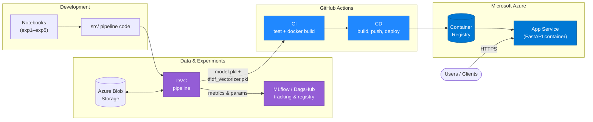
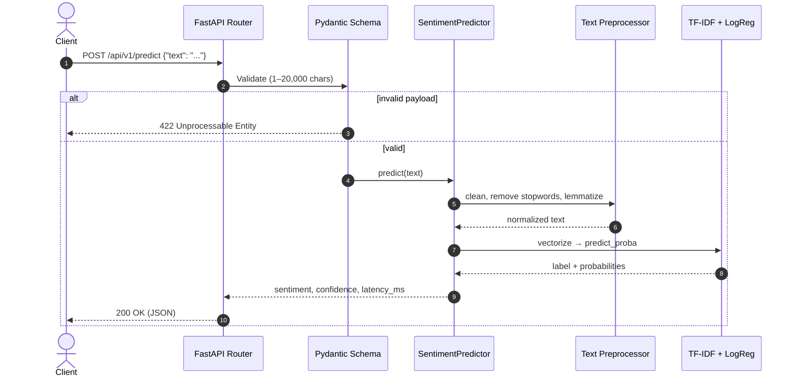
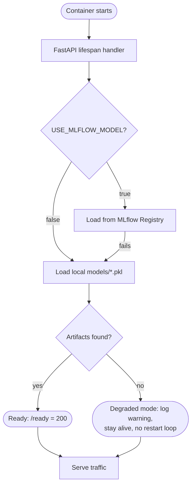
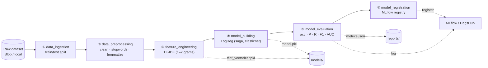
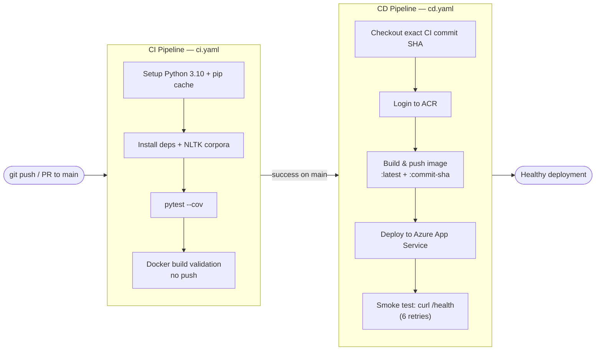
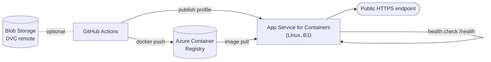

<div align="center">

# Sentiment Analysis — End-to-End MLOps on Azure

**A sentiment classifier with the full MLOps loop around it: reproducible DVC pipeline → MLflow tracking → FastAPI service → Docker → GitHub Actions CI/CD → Azure App Service.**

[](https://python.org)
[](https://fastapi.tiangolo.com/)
[](https://scikit-learn.org/)
[](https://dvc.org/)
[](https://dagshub.com/rohitkr8527/sentiment-analysis.mlflow/#/)
[](https://www.docker.com/)
[](https://azure.microsoft.com/)
[](.github/workflows)
[](LICENSE)

[Highlights](#highlights) · [Architecture](#architecture) · [Quick Start](#quick-start) · [API](#api) · [Pipeline](#ml-pipeline) · [CI/CD](#cicd) · [Azure](#azure-deployment)

</div>

---

## What is this?

An end-to-end system that classifies text (reviews, posts, chats) as **Positive** or **Negative** in a few milliseconds. The model is deliberately simple (TF-IDF + Logistic Regression). The focus is the **engineering around it**: versioned data, tracked experiments, tested APIs, hardened containers, and fully automated delivery to the cloud.

| Positive review | Negative review |
|:---:|:---:|
|  |  |

---

## Highlights

| | |
|---|---|
| **Reproducible ML** | 5-stage DVC pipeline driven by `params.yaml`, with Azure Blob remote support |
| **Experiment tracking** | MLflow (DagsHub) for metrics, artifacts and model registry |
| **Fast inference** | FastAPI + Pydantic v2; model loaded once at startup (lifespan handler) |
| **Dual interface** | REST API (`/api/v1/predict`) and an interactive web UI |
| **Observability** | `/health`, `/ready` probes and Prometheus `/metrics` |
| **Hardened container** | Multi-stage build, non-root user, baked-in NLTK data, `HEALTHCHECK` |
| **Automated delivery** | CI (tests + Docker validation) → CD (push to ACR → deploy → smoke test) |
| **Tested** | 15 pytest tests covering preprocessing, model contract, API, validation and metrics |

### Model performance (hold-out test set)

| Accuracy | Precision | Recall | F1 | ROC AUC |
|:---:|:---:|:---:|:---:|:---:|
| **82.08%** | **82.27%** | **81.79%** | **82.03%** | **0.9016** |

Trained on a balanced sentiment dataset (80/20 split). Config: TF-IDF (10k features, 1–2 grams) + Logistic Regression (`saga`, elasticnet). A quality gate (`min_accuracy`/`min_f1` ≥ 0.75) is defined in [`params.yaml`](params.yaml).


---

## Architecture

### System overview


```mermaid
flowchart LR
    subgraph DEV[" Development"]
        NB["Notebooks<br/>(exp1–exp5)"]
        SRC["src/ pipeline code"]
    end

    subgraph DATA[" Data & Experiments"]
        BLOB[("Azure Blob<br/>Storage")]
        DVC["DVC<br/>pipeline"]
        MLF["MLflow / DagsHub<br/>tracking & registry"]
    end

    subgraph CICD[" GitHub Actions"]
        CI["CI<br/>test + docker build"]
        CD["CD<br/>build, push, deploy"]
    end

    subgraph AZ[" Microsoft Azure"]
        ACR[("Container<br/>Registry")]
        APP["App Service<br/>(FastAPI container)"]
    end

    USER([" Users / Clients"])

    NB --> SRC --> DVC
    BLOB <--> DVC
    DVC -- "metrics & params" --> MLF
    DVC -- "model.pkl +<br/>tfidf_vectorizer.pkl" --> CI
    CI --> CD --> ACR --> APP
    USER -- "HTTPS" --> APP

    classDef azure fill:#0078D4,color:#fff,stroke:#005a9e;
    classDef ml fill:#945DD6,color:#fff,stroke:#6b3fa0;
    classDef ci fill:#2088FF,color:#fff,stroke:#0b5cc4;
    class ACR,APP azure;
    class DVC,MLF ml;
    class CI,CD ci;
```

### Runtime request flow


```mermaid
sequenceDiagram
    autonumber
    actor C as Client
    participant R as FastAPI Router
    participant V as Pydantic Schema
    participant P as SentimentPredictor
    participant T as Text Preprocessor
    participant M as TF-IDF + LogReg

    C->>R: POST /api/v1/predict {"text": "..."}
    R->>V: Validate (1–20,000 chars)
    alt invalid payload
        V-->>C: 422 Unprocessable Entity
    else valid
        V->>P: predict(text)
        P->>T: clean, remove stopwords, lemmatize
        T-->>P: normalized text
        P->>M: vectorize → predict_proba
        M-->>P: label + probabilities
        P-->>R: sentiment, confidence, latency_ms
        R-->>C: 200 OK (JSON)
    end
```

### Service startup & graceful degradation


```mermaid
flowchart TD
    A([Container starts]) --> B[FastAPI lifespan handler]
    B --> C{USE_MLFLOW_MODEL?}
    C -- true --> D[Load from MLflow Registry]
    C -- false --> E[Load local models/*.pkl]
    D -- fails --> E
    E --> F{Artifacts found?}
    F -- yes --> G([Ready: /ready = 200])
    F -- no --> H([Degraded mode: log warning,<br/>stay alive, no restart loop])
    G --> I[Serve traffic]
    H --> I
```

---

## Quick Start

```bash
git clone https://github.com/rohitkr8527/sentiment-analysis.git
cd sentiment-analysis

python -m venv .venv
source .venv/bin/activate          # Windows: .\.venv\Scripts\activate
pip install -r requirements.txt
cp .env.example .env               # optional for local runs

uvicorn fastapi_app.app:app --reload --port 8000
```

Open **http://localhost:8000** (UI) or **http://localhost:8000/docs** (Swagger).

<details>
<summary><b>Run with Docker / Docker Compose</b></summary>

```bash
# Docker
docker build -t sentiment-analysis-api .
docker run -d --name sentiment-app -p 8000:8000 sentiment-analysis-api

# Docker Compose
docker compose up --build -d
docker compose logs -f
```
</details>

---

## API

| Method | Endpoint | Description |
|---|---|---|
| `GET` | `/` | Web UI |
| `POST` | `/predict` | Web UI form submission |
| `POST` | `/api/v1/predict` | JSON prediction |
| `GET` | `/health` | Liveness probe |
| `GET` | `/ready` | Readiness probe |
| `GET` | `/metrics` | Prometheus metrics |
| `GET` | `/docs` · `/redoc` | OpenAPI documentation |

```bash
curl -X POST http://localhost:8000/api/v1/predict \
  -H "Content-Type: application/json" \
  -d '{"text": "The build quality exceeded my expectations!"}'
```

```json
{
  "text": "The build quality exceeded my expectations!",
  "sentiment": "Positive",
  "label": 1,
  "confidence": 0.8924,
  "latency_ms": 3.42
}
```

---

## ML Pipeline

Defined in [`dvc.yaml`](dvc.yaml) and parameterised by [`params.yaml`](params.yaml).


```mermaid
flowchart LR
    RAW[("Raw dataset<br/>Blob / local")] --> S1
    S1["① data_ingestion<br/>train/test split"] --> S2
    S2["② data_preprocessing<br/>clean · stopwords · lemmatize"] --> S3
    S3["③ feature_engineering<br/>TF-IDF (1–2 grams)"] --> S4
    S4["④ model_building<br/>LogReg (saga, elasticnet)"] --> S5
    S5["⑤ model_evaluation<br/>acc · P · R · F1 · AUC"] --> S6
    S6["⑥ model_registration<br/>MLflow registry"]

    S3 -. "tfidf_vectorizer.pkl" .-> ART[("models/")]
    S4 -. "model.pkl" .-> ART
    S5 -. "metrics.json" .-> REP[("reports/")]
    S5 -. "log" .-> MLF["MLflow / DagsHub"]
    S6 -. "register" .-> MLF
```

```bash
dvc repro      # run only the stages whose deps/params changed
dvc status
```

### Experiment Tracking

All runs (parameters, metrics, artifacts and registered models) are logged to MLflow hosted on DagsHub:

**[dagshub.com/rohitkr8527/sentiment-analysis.mlflow](https://dagshub.com/rohitkr8527/sentiment-analysis.mlflow/#/)**

The five notebooks in [`notebooks/`](notebooks) (BoW vs TF-IDF, vectorizer comparison, hyperparameter tuning) point to this tracking server by default. Override it with the `MLFLOW_TRACKING_URI` environment variable, or set `DAGSHUB_REPO_OWNER` / `DAGSHUB_REPO_NAME` / `DAGSHUB_TOKEN` (see [Configuration](#configuration)).


---

## CI/CD


```mermaid
flowchart LR
    DEV([git push / PR to main]) --> CI

    subgraph CI["CI Pipeline — ci.yaml"]
        direction TB
        C1[Setup Python 3.10 + pip cache] --> C2[Install deps + NLTK corpora]
        C2 --> C3["pytest --cov"]
        C3 --> C4[Docker build validation<br/>no push]
    end

    CI -- "success on main" --> CD

    subgraph CD["CD Pipeline — cd.yaml"]
        direction TB
        D1[Checkout exact CI commit SHA] --> D2[Login to ACR]
        D2 --> D3["Build & push image<br/>:latest + :commit-sha"]
        D3 --> D4[Deploy to Azure App Service]
        D4 --> D5["Smoke test: curl /health<br/>(6 retries)"]
    end

    CD --> LIVE([Healthy deployment ])
```

**Design notes**
- CD is triggered by `workflow_run` and only runs when CI **succeeded**; it deploys the **exact commit SHA** that passed CI (immutable tag) and can also be run manually.
- Docker layer cache is shared across runs via GitHub Actions cache.
- The deploy is verified by a health check with retries, so a broken release fails the pipeline.

<details>
<summary><b>Required GitHub secrets for CD</b></summary>

| Secret | Description |
|---|---|
| `ACR_LOGIN_SERVER` | e.g. `myregistry.azurecr.io` |
| `ACR_USERNAME` / `ACR_PASSWORD` | ACR admin credentials |
| `AZURE_WEBAPP_NAME` | App Service name |
| `AZURE_WEBAPP_PUBLISH_PROFILE` | Contents of the App Service publish profile XML |
</details>

---

## Azure Deployment


```mermaid
flowchart LR
    GH[GitHub Actions] -- "docker push" --> ACR[("Azure Container<br/>Registry")]
    GH -- "publish profile" --> APP
    ACR -- "image pull" --> APP["App Service for Containers<br/>(Linux, B1)"]
    APP -- "health check /health" --> APP
    APP --> HTTPS(["Public HTTPS endpoint"])
    BLOB[("Blob Storage<br/>DVC remote")] -. "optional" .- GH
```

<details>
<summary><b>Provision from scratch with Azure CLI</b></summary>

```bash
az login
az group create --name rg-sentiment-prod --location eastus

# Container Registry
ACR_NAME="sentimentacr$RANDOM"
az acr create -g rg-sentiment-prod -n $ACR_NAME --sku Basic --admin-enabled true
ACR_USERNAME=$(az acr credential show -n $ACR_NAME --query username -o tsv)
ACR_PASSWORD=$(az acr credential show -n $ACR_NAME --query "passwords[0].value" -o tsv)

# Build & push without local Docker
az acr build --registry $ACR_NAME --image sentiment-analysis:latest .

# App Service
az appservice plan create -n plan-sentiment-prod -g rg-sentiment-prod --sku B1 --is-linux
APP_NAME="sentiment-service-$RANDOM"
az webapp create -g rg-sentiment-prod --plan plan-sentiment-prod -n $APP_NAME \
  --deployment-container-image-name "$ACR_NAME.azurecr.io/sentiment-analysis:latest"
az webapp config container set -n $APP_NAME -g rg-sentiment-prod \
  --docker-custom-image-name "$ACR_NAME.azurecr.io/sentiment-analysis:latest" \
  --docker-registry-server-url "https://$ACR_NAME.azurecr.io" \
  --docker-registry-server-user "$ACR_USERNAME" \
  --docker-registry-server-password "$ACR_PASSWORD"

# Settings & health probe
az webapp config appsettings set -n $APP_NAME -g rg-sentiment-prod \
  --settings WEBSITES_PORT=8000 PORT=8000 ENVIRONMENT=production LOG_LEVEL=INFO
az webapp config set -n $APP_NAME -g rg-sentiment-prod \
  --generic-configurations '{"healthCheckPath": "/health"}'

# Publish profile → GitHub secret AZURE_WEBAPP_PUBLISH_PROFILE
az webapp deployment list-publishing-profiles -n $APP_NAME -g rg-sentiment-prod --xml

# Verify
curl https://$APP_NAME.azurewebsites.net/health
```
</details>

---

## Tech Stack

| Layer | Tools |
|---|---|
| **Serving** | FastAPI, Uvicorn, Pydantic v2, Jinja2, Prometheus client |
| **ML / NLP** | scikit-learn, NLTK (stopwords, WordNet lemmatizer), Pandas, NumPy |
| **MLOps** | DVC, MLflow, DagsHub, Azure Blob Storage |
| **Packaging** | Docker (multi-stage, non-root), Docker Compose |
| **Quality** | pytest, pytest-cov |
| **CI/CD & Cloud** | GitHub Actions, Azure Container Registry, Azure App Service |

---

## Project Structure

<details>
<summary><b>Expand tree</b></summary>

```
sentiment-analysis/
├── .github/workflows/     # ci.yaml, cd.yaml
├── data/                  # raw / interim / processed (DVC-managed)
├── fastapi_app/           # Production service
│   ├── core/              # Settings & path resolution
│   ├── routes/            # api, web, health, metrics
│   ├── schemas/           # Pydantic models
│   ├── services/          # predictor + text preprocessor
│   ├── templates/         # Web UI
│   └── app.py             # App factory + lifespan
├── models/                # model.pkl, tfidf_vectorizer.pkl
├── notebooks/             # exp1–exp5 experiments
├── reports/               # metrics.json, figures
├── scripts/               # promote_model.py (MLflow stage promotion)
├── src/                   # Training pipeline
│   ├── connections/       # Azure Blob client
│   ├── data/              # ingestion, preprocessing
│   ├── features/          # TF-IDF
│   ├── model/             # build, evaluate, register
│   └── utils/ · logger/
├── tests/                 # test_model.py, test_fastapi_app.py
├── Dockerfile · docker-compose.yml
├── dvc.yaml · params.yaml
└── requirements.txt
```
</details>

---

## Configuration

<details>
<summary><b>Environment variables</b> (see <code>.env.example</code>)</summary>

| Variable | Default | Purpose |
|---|---|---|
| `PORT` / `HOST` | `8000` / `0.0.0.0` | Bind address |
| `ENVIRONMENT` | `production` | Runtime environment |
| `LOG_LEVEL` | `INFO` | Logging verbosity |
| `CORS_ORIGINS` | `*` | Allowed origins |
| `MODEL_PATH` | `models/model.pkl` | Classifier artifact |
| `VECTORIZER_PATH` | `models/tfidf_vectorizer.pkl` | Vectorizer artifact |
| `USE_MLFLOW_MODEL` | `false` | Load model from MLflow Registry |
| `AZURE_STORAGE_CONNECTION_STRING` | — | DVC / data ingestion from Blob |
| `AZURE_BLOB_CONTAINER_NAME` | `sentiment-data` | Blob container |
| `DAGSHUB_TOKEN` / `DAGSHUB_REPO_OWNER` / `DAGSHUB_REPO_NAME` | — | MLflow tracking on DagsHub |
</details>

---

## Testing

```bash
pytest tests/ -v --cov=fastapi_app --cov=src
```

Covers artifact presence, text normalization, model/vectorizer dimensions, semantic predictions, hold-out performance thresholds, probes, web form, REST contract, input validation and the metrics endpoint.

---

## Troubleshooting

<details>
<summary><b>Common issues</b></summary>

- **Port binding on Azure** – the container binds to `${PORT:-8000}`; set `WEBSITES_PORT=8000`.
- **Missing NLTK data** – baked into the image at `/app/nltk_data`; the preprocessor also lazily downloads on demand.
- **Startup timeouts / restart loops** – missing artifacts put the service in degraded mode instead of crashing.
</details>

---

## Roadmap

- [ ] Multi-class / neutral sentiment
- [ ] Transformer baseline (DistilBERT) vs. TF-IDF benchmark
- [ ] Model drift monitoring with Prometheus + Grafana
- [ ] Infrastructure-as-Code (Bicep/Terraform)

---

## License

Released under the [MIT License](LICENSE).

<div align="center">

**Built by [Rohit Kumar](https://github.com/rohitkr8527)** · If you found this useful, consider giving it a 

</div>
