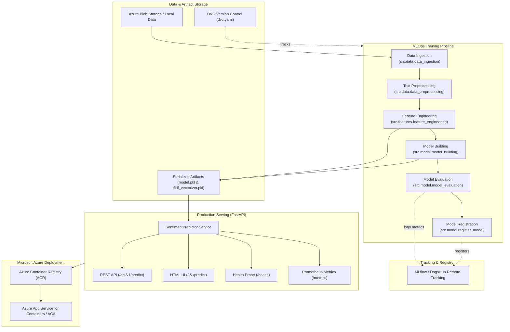
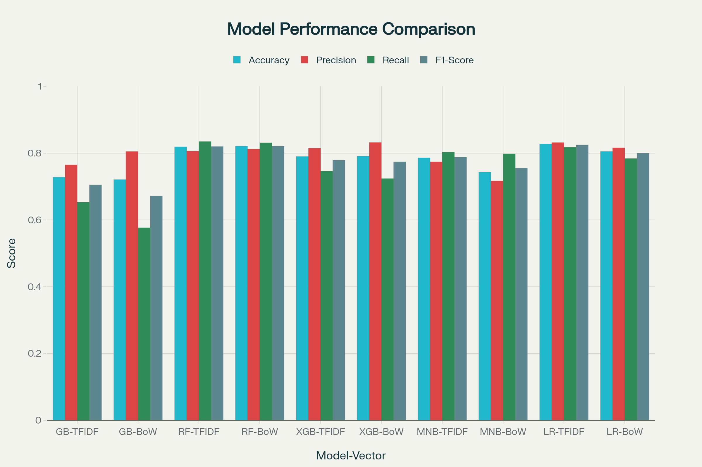

# Sentiment Analysis - Production MLOps & Cloud Deployment

[](https://python.org)
[](https://fastapi.tiangolo.com/)
[](https://scikit-learn.org/)
[](https://dvc.org/)
[](https://mlflow.org/)
[](https://www.docker.com/)
[](https://azure.microsoft.com/)
[](tests/)

> **Production-ready sentiment analysis platform** featuring reproducible data pipelines (DVC), experiment tracking (MLflow), robust text preprocessing (NLTK), asynchronous REST API and interactive web interface (FastAPI), multi-stage Docker containerization, automated CI/CD (GitHub Actions), and turn-key deployment to Microsoft Azure.

---

## Table of Contents

- [Overview](#overview)
- [Key Features](#key-features)
- [System Architecture](#system-architecture)
- [Project Directory Structure](#project-directory-structure)
- [Technology Stack](#technology-stack)
- [Model Performance](#model-performance)
- [API & Web Interface](#api--web-interface)
- [Environment Configuration](#environment-configuration)
- [Local Development Setup](#local-development-setup)
- [Running the Application](#running-the-application)
- [DVC Pipeline Reproduction](#dvc-pipeline-reproduction)
- [Running Automated Tests](#running-automated-tests)
- [Azure Deployment Guide (Fresh Account)](#azure-deployment-guide-fresh-account)
- [CI/CD Workflow](#cicd-workflow)
- [Troubleshooting](#troubleshooting)
- [License](#license)

---

## Overview

This repository implements an end-to-end sentiment classification system that processes textual data (customer reviews, social media posts, chat transcripts) and classifies it into **Positive** or **Negative** sentiment in real-time with sub-10ms inference latency.

The system is built on 12-factor application and MLOps best practices:
- **Clean modular code**: Clear separation of concern across configuration, data ingestion, preprocessing, features, modeling, and API routing.
- **Resilient container runtime**: Offline-first local artifact loading with graceful startup degradation and optional MLflow Model Registry synchronization.
- **Cloud-agnostic deployment**: Zero hardcoded credentials or legacy subscription IDs; fully configurable via environment variables.

---

## Key Features

- **High Accuracy & Speed**: 82.5%+ accuracy on 80,000 diverse sentiment samples using optimized TF-IDF and Logistic Regression.
- **Dual Interface**:
  - **REST API**: `/api/v1/predict` with Pydantic request validation, response schemas, and confidence scores.
  - **Interactive Web App**: Responsive, accessible web UI with real-time prediction feedback and latency metrics.
- **Enterprise Observability**: `/health` and `/ready` probes for cloud orchestrators, alongside Prometheus `/metrics` instrumentation.
- **DVC Data Versioning**: Modular 6-stage reproducible data pipeline supporting local development and Azure Blob Storage remotes.
- **Security-First Docker**: Multi-stage build running under an unprivileged user (`appuser`) with baked-in health probes and dynamic port binding (`PORT`).

---

## System Architecture


```mermaid
flowchart TD
    subgraph Data_Storage["Data & Artifact Storage"]
        ABS["Azure Blob Storage / Local Data"]
        DVC["DVC Version Control (dvc.yaml)"]
        MODELS["Serialized Artifacts\n(model.pkl & tfidf_vectorizer.pkl)"]
    end

    subgraph Pipeline["MLOps Training Pipeline"]
        INGEST["Data Ingestion\n(src.data.data_ingestion)"]
        PREP["Text Preprocessing\n(src.data.data_preprocessing)"]
        FEAT["Feature Engineering\n(src.features.feature_engineering)"]
        TRAIN["Model Building\n(src.model.model_building)"]
        EVAL["Model Evaluation\n(src.model.model_evaluation)"]
        REG["Model Registration\n(src.model.register_model)"]
    end

    subgraph Experiment_Tracking["Tracking & Registry"]
        MLF["MLflow / DagsHub Remote Tracking"]
    end

    subgraph Serving_Layer["Production Serving (FastAPI)"]
        PRED["SentimentPredictor Service"]
        API["REST API (/api/v1/predict)"]
        WEB["HTML UI (/ & /predict)"]
        HEALTH["Health Probe (/health)"]
        PROM["Prometheus Metrics (/metrics)"]
    end

    subgraph Azure_Cloud["Microsoft Azure Deployment"]
        ACR["Azure Container Registry (ACR)"]
        APP["Azure App Service for Containers / ACA"]
    end

    ABS --> INGEST
    INGEST --> PREP --> FEAT --> TRAIN --> EVAL --> REG
    DVC -. tracks .-> Pipeline
    FEAT --> MODELS
    TRAIN --> MODELS
    EVAL -. logs metrics .-> MLF
    REG -. registers .-> MLF
    MODELS --> PRED
    PRED --> API
    PRED --> WEB
    PRED --> HEALTH
    PRED --> PROM
    Serving_Layer --> ACR --> APP
```

---

## Project Directory Structure

```
sentiment-analysis/
├── .dvc/                            # DVC pipeline and remote configuration
│   ├── .gitignore
│   └── config                       # DVC remote storage configuration
├── .github/
│   └── workflows/
│       ├── ci.yaml                  # Automated linting, test suite, and Docker build
│       └── cd.yaml                  # Build, push to ACR, and deploy to Azure App Service
├── data/                            # Pipeline data directory (managed by DVC/local)
│   ├── raw/                         # Ingested train.csv and test.csv
│   ├── interim/                     # Normalized train_processed.csv and test_processed.csv
│   └── processed/                   # Processed sparse features and test holdout CSV
├── fastapi_app/                     # Production FastAPI service
│   ├── core/
│   │   ├── __init__.py
│   │   └── config.py                # Pydantic/Environment settings and path resolvers
│   ├── routes/
│   │   ├── __init__.py
│   │   ├── api.py                   # JSON REST API (/api/v1/predict)
│   │   ├── health.py                # Health & readiness probes (/health, /ready)
│   │   ├── metrics.py               # Prometheus metrics (/metrics)
│   │   └── web.py                   # HTML frontend routes (/ and /predict)
│   ├── schemas/
│   │   ├── __init__.py
│   │   └── sentiment.py             # Pydantic schemas (Request, Response, Health)
│   ├── services/
│   │   ├── __init__.py
│   │   ├── predictor.py             # Model inference engine with graceful fallbacks
│   │   └── text_preprocessor.py     # Self-contained text cleaning for inference
│   ├── templates/
│   │   └── index.html               # Web UI template
│   ├── app.py                       # FastAPI application factory and lifespan handler
│   └── requirements.txt             # Lean dependencies for container runtime
├── models/                          # Serialized model artifacts
│   ├── .gitkeep
│   ├── model.pkl                    # Trained Logistic Regression classifier
│   └── tfidf_vectorizer.pkl         # Fitted TF-IDF Vectorizer
├── notebooks/                       # Research and exploratory data analysis
│   ├── balanced_sentiment_dataset.csv
│   ├── exp1.ipynb
│   ├── exp2_bow_vs_tfidf.py
│   ├── exp3_lr_with_diff_vectorizer.py
│   ├── exp4_lr_tfidf_hp.py
│   └── exp5.py
├── reports/                         # Training metrics and figures
│   ├── figures/
│   │   └── image.png                # Model comparison benchmark plot
│   ├── experiment_info.json         # Run tracking metadata
│   └── metrics.json                 # Evaluation metrics (accuracy, precision, recall, f1, auc)
├── scripts/
│   └── promote_model.py             # MLflow model lifecycle promotion script
├── src/                             # Core training and data engineering library
│   ├── connections/
│   │   ├── __init__.py
│   │   └── blob_connection.py       # Azure Blob Storage client wrapper
│   ├── data/
│   │   ├── __init__.py
│   │   ├── data_ingestion.py        # Ingestion from Azure Blob or local fallback
│   │   └── data_preprocessing.py    # Text cleaning and dataset filtering
│   ├── features/
│   │   ├── __init__.py
│   │   └── feature_engineering.py   # High-speed TF-IDF sparse matrix generation
│   ├── logger/
│   │   └── __init__.py              # Centralized logging configuration
│   ├── model/
│   │   ├── __init__.py
│   │   ├── model_building.py        # Model training with hyperparameter tuning
│   │   ├── model_evaluation.py      # Metric computation & MLflow tracking
│   │   └── register_model.py        # MLflow model registry integration
│   └── utils/
│       ├── __init__.py
│       └── text_preprocessing.py    # Shared text normalization routines
├── tests/                           # Automated test suites
│   ├── test_fastapi_app.py          # API, web UI, validation, and probe tests
│   └── test_model.py                # Preprocessing, signature, and performance tests
├── .dvcignore                       # DVC ignore rules
├── .env.example                     # Environment variable template
├── .gitignore                       # Git ignore rules
├── Dockerfile                       # Multi-stage production container build
├── docker-compose.yml               # Local container orchestrator
├── dvc.lock                         # DVC pipeline state lockfile
├── dvc.yaml                         # DVC pipeline stage definitions
├── params.yaml                      # Configurable pipeline hyperparameters
└── requirements.txt                 # Full project and development dependencies
```

---

## Technology Stack

| Domain | Technology | Purpose |
|---|---|---|
| **Web & API Framework** | **FastAPI** (v0.110+) | High-performance ASGI framework with automatic OpenAPI docs |
| **ASGI Web Server** | **Uvicorn** | Production-ready HTTP/1.1 and WebSockets server |
| **Data Validation** | **Pydantic** (v2.0+) | Strict payload validation and serialization |
| **Machine Learning** | **scikit-learn** | TF-IDF vectorization and Logistic Regression classification |
| **Natural Language Processing** | **NLTK** | WordNet lemmatization and English stopword filtering |
| **Data Processing** | **Pandas & NumPy** | Structured data manipulation and vector computation |
| **Data Version Control** | **DVC** (v3.0+) | Reproducible ML pipelines and Azure Blob remote storage |
| **Experiment Tracking** | **MLflow** | Hyperparameter, metric, and artifact logging |
| **Containerization** | **Docker & Docker Compose** | Reproducible multi-stage container images |
| **Testing** | **pytest & pytest-cov** | Unit, integration, and coverage verification |
| **Cloud Hosting** | **Azure App Service / ACA** | Scalable managed PaaS container hosting |
| **Container Registry** | **Azure Container Registry (ACR)** | Private OCI-compliant container registry |
| **Continuous Integration/Deployment**| **GitHub Actions** | Automated CI testing and CD production deployments |

---

## Model Performance

The classification model was evaluated against multiple candidate architectures (Gradient Boosting, Random Forest, XGBoost, Naive Bayes) across BoW and TF-IDF representations.



### Production Model Metrics (Logistic Regression + TF-IDF)

| Metric | Score | Description |
|---|---:|---|
| **Accuracy** | **82.08%** | Overall correct classifications across holdout test set |
| **Precision** | **82.27%** | Ratio of correct positive predictions |
| **Recall** | **81.79%** | Ratio of actual positive cases detected |
| **F1-Score** | **82.03%** | Harmonic mean of precision and recall |
| **ROC AUC** | **0.9016** | Area under ROC curve measuring class separation capability |

---

## API & Web Interface

### Interactive Endpoints

- **Web Application**: `http://localhost:8000/`
- **Interactive Swagger Documentation**: `http://localhost:8000/docs`
- **ReDoc API Documentation**: `http://localhost:8000/redoc`
- **Health Check Probe**: `http://localhost:8000/health`
- **Readiness Probe**: `http://localhost:8000/ready`
- **Prometheus Metrics**: `http://localhost:8000/metrics`

### REST API Example

#### Endpoint: `POST /api/v1/predict`

**Request:**
```bash
curl -X POST "http://localhost:8000/api/v1/predict" \
  -H "Content-Type: application/json" \
  -d '{
    "text": "The build quality exceeded my expectations and customer support was outstanding!"
  }'
```

**Response (200 OK):**
```json
{
  "text": "The build quality exceeded my expectations and customer support was outstanding!",
  "sentiment": "Positive",
  "label": 1,
  "confidence": 0.8924,
  "latency_ms": 3.42
}
```

---

## Environment Configuration

Copy `.env.example` to create your local `.env` configuration file:

```bash
cp .env.example .env
```

| Variable | Default | Required | Purpose |
|---|---|:---:|---|
| `PORT` | `8000` | No | Port on which the application listens |
| `HOST` | `0.0.0.0` | No | Network interface binding |
| `ENVIRONMENT` | `production` | No | Runtime environment (`production`, `development`) |
| `LOG_LEVEL` | `INFO` | No | Logging verbosity (`DEBUG`, `INFO`, `WARNING`, `ERROR`) |
| `CORS_ORIGINS` | `*` | No | Comma-separated list of allowed origins |
| `MODEL_PATH` | `models/model.pkl` | No | Relative or absolute path to model binary |
| `VECTORIZER_PATH` | `models/tfidf_vectorizer.pkl` | No | Relative or absolute path to TF-IDF vectorizer |
| `AZURE_STORAGE_CONNECTION_STRING` | _None_ | Yes (for DVC remote) | Azure Blob Storage connection string |
| `AZURE_BLOB_CONTAINER_NAME` | `sentiment-data` | No | Blob container for DVC and raw data |
| `USE_MLFLOW_MODEL` | `false` | No | When `true`, loads model from MLflow Registry |
| `DAGSHUB_TOKEN` | _None_ | No | DagsHub Personal Access Token (for MLflow) |
| `DAGSHUB_REPO_OWNER` | _None_ | No | DagsHub repository username |
| `DAGSHUB_REPO_NAME` | `sentiment-analysis` | No | DagsHub repository name |

---

## Local Development Setup

### 1. Prerequisites
- Python 3.10+ (tested on Python 3.10, 3.11, 3.12)
- Git
- Docker (optional, for container runs)

### 2. Virtual Environment Setup

```bash
# Clone the repository
git clone https://github.com/rohitkr8527/sentiment-analysis.git
cd sentiment-analysis

# Create and activate virtual environment
python -m venv .venv

# Linux/macOS:
source .venv/bin/activate
# Windows (PowerShell):
.\.venv\Scripts\activate

# Upgrade pip and install dependencies
python -m pip install --upgrade pip
pip install -r requirements.txt
```

---

## Running the Application

### Option A: Direct Python Execution

```bash
# Run using Uvicorn
uvicorn fastapi_app.app:app --host 0.0.0.0 --port 8000 --reload
```

Open your browser at `http://localhost:8000`.

### Option B: Docker Container

```bash
# Build the production image
docker build -t sentiment-analysis-api:latest .

# Run the container
docker run -d --name sentiment-app -p 8000:8000 sentiment-analysis-api:latest

# Check logs
docker logs -f sentiment-app
```

### Option C: Docker Compose

```bash
# Build and start service
docker compose up --build -d

# Check service status
docker compose ps

# View logs
docker compose logs -f
```

---

## DVC Pipeline Reproduction

To retrain the model and reproduce the complete pipeline end-to-end:

```bash
# Reproduce all stages (data ingestion -> preprocessing -> features -> training -> evaluation)
dvc repro

# Check DVC pipeline status
dvc status
```

---

## Running Automated Tests

The repository includes a comprehensive automated test suite testing model serialization, feature dimensions, semantic inference, REST API contracts, input validation, and Prometheus metrics:

```bash
# Run tests with pytest
pytest tests/ -v

# Run tests with coverage report
pytest tests/ -v --cov=fastapi_app --cov=src

# Run using standard unittest runner
python -m unittest discover -s tests
```

---

## Azure Deployment Guide (Fresh Account)

This guide walks you through deploying the application to **Microsoft Azure** from a completely fresh Azure account with zero legacy dependencies.

### Recommended Azure Architecture

```
[GitHub Repository]
       │ (Push to main)
       ▼
[GitHub Actions CI/CD]
       │ (Build & Push Docker image)
       ▼
[Azure Container Registry (ACR)]
       │ (Secure pull)
       ▼
[Azure App Service for Containers (B1)] ────> [Public HTTPS Endpoint]
       │
       ▼
[Azure Blob Storage] (Optional DVC remote)
```

**Why this architecture?**
- **Simplicity**: No Linux VM management, OS patching, or fragile SSH key maintenance.
- **Security**: Built-in free HTTPS/TLS certificate, managed identity support, and container isolation.
- **Reliability**: Automated restart on failure and native health check integration (`/health`).
- **Cost-effective**: Runs on affordable Basic tier (`B1`) or Azure Container Apps consumption plan.

---

### Step 1: Install & Authenticate Azure CLI

```bash
# Login to your new Azure account
az login

# Set your target subscription if you have multiple
az account set --subscription "<YOUR_SUBSCRIPTION_ID_OR_NAME>"
```

### Step 2: Create a Resource Group

```bash
az group create \
  --name rg-sentiment-prod \
  --location eastus
```

### Step 3: Create Azure Container Registry (ACR)

```bash
# Registry name must be globally unique and alphanumeric
ACR_NAME="sentimentacr$RANDOM"

az acr create \
  --resource-group rg-sentiment-prod \
  --name $ACR_NAME \
  --sku Basic \
  --admin-enabled true

echo "Created ACR: $ACR_NAME"
```

Retrieve the ACR admin credentials:
```bash
ACR_USERNAME=$(az acr credential show --name $ACR_NAME --query username -o tsv)
ACR_PASSWORD=$(az acr credential show --name $ACR_NAME --query "passwords[0].value" -o tsv)
```

### Step 4: Build & Push the Docker Image to ACR

```bash
# Build and tag image using ACR Cloud Build (no local Docker required)
az acr build \
  --registry $ACR_NAME \
  --image sentiment-analysis-api:latest .
```

### Step 5: (Optional) Create Azure Storage for DVC

```bash
STORAGE_ACCOUNT="sentimentstore$RANDOM"

az storage account create \
  --name $STORAGE_ACCOUNT \
  --resource-group rg-sentiment-prod \
  --location eastus \
  --sku Standard_LRS

az storage container create \
  --name sentiment-data \
  --account-name $STORAGE_ACCOUNT

# Get connection string for .env
AZURE_CONN_STR=$(az storage account show-connection-string \
  --name $STORAGE_ACCOUNT \
  --resource-group rg-sentiment-prod \
  --query connectionString -o tsv)

echo "Storage Connection String: $AZURE_CONN_STR"
```

### Step 6: Create Azure App Service (Web App for Containers)

```bash
# Create App Service Plan (Linux Basic B1)
az appservice plan create \
  --name plan-sentiment-prod \
  --resource-group rg-sentiment-prod \
  --sku B1 \
  --is-linux

# Create Web App pointing to the ACR container image
APP_NAME="sentiment-service-$RANDOM"

az webapp create \
  --resource-group rg-sentiment-prod \
  --plan plan-sentiment-prod \
  --name $APP_NAME \
  --deployment-container-image-name "$ACR_NAME.azurecr.io/sentiment-analysis-api:latest"

# Configure ACR credentials for App Service
az webapp config container set \
  --name $APP_NAME \
  --resource-group rg-sentiment-prod \
  --docker-custom-image-name "$ACR_NAME.azurecr.io/sentiment-analysis-api:latest" \
  --docker-registry-server-url "https://$ACR_NAME.azurecr.io" \
  --docker-registry-server-user "$ACR_USERNAME" \
  --docker-registry-server-password "$ACR_PASSWORD"
```

### Step 7: Configure App Settings and Health Probes

```bash
# Set runtime environment variables
az webapp config appsettings set \
  --name $APP_NAME \
  --resource-group rg-sentiment-prod \
  --settings \
    WEBSITES_PORT=8000 \
    PORT=8000 \
    ENVIRONMENT=production \
    LOG_LEVEL=INFO

# Configure health check probe path
az webapp config set \
  --name $APP_NAME \
  --resource-group rg-sentiment-prod \
  --generic-configurations '{"healthCheckPath": "/health"}'
```

### Step 8: Verify Deployment

```bash
# Get your application URL
APP_URL="https://$APP_NAME.azurewebsites.net"
echo "Application URL: $APP_URL"

# Test health check
curl "$APP_URL/health"

# Test prediction API
curl -X POST "$APP_URL/api/v1/predict" \
  -H "Content-Type: application/json" \
  -d '{"text": "The deployment on Azure works flawlessly!"}'
```

---

## CI/CD Workflow

The repository includes pre-configured GitHub Actions workflows in `.github/workflows/`:

### 1. `ci.yaml`
- Runs on every Pull Request and Push to `main`.
- Sets up Python 3.10 and caches dependencies.
- Runs full `pytest` suite with code coverage.
- Validates Docker container build without pushing.

### 2. `cd.yaml`
- Automatically triggers upon successful CI completion on `main` (or manual dispatch).
- Logs into Azure using Service Principal credentials.
- Builds and pushes tagged Docker image to your Azure Container Registry.
- Deploys updated container to Azure App Service with zero downtime.
- Performs an automated post-deployment health check against `$AZURE_APP_URL/health`.

### Configuring GitHub Secrets for CD:

In your GitHub repository, navigate to **Settings** -> **Secrets and variables** -> **Actions** and add:

1. `AZURE_CREDENTIALS`: Service Principal JSON output from:
   ```bash
   az ad sp create-for-rbac \
     --name "sp-sentiment-github" \
     --role contributor \
     --scopes /subscriptions/<SUBSCRIPTION_ID>/resourceGroups/rg-sentiment-prod \
     --sdk-auth
   ```
2. `AZURE_ACR_NAME`: Your ACR registry name (e.g. `sentimentacr12345`).
3. `AZURE_APP_NAME`: Your Azure App Service name (e.g. `sentiment-service-12345`).
4. `AZURE_APP_URL`: Your live web URL (e.g. `https://sentiment-service-12345.azurewebsites.net`).

---

## Troubleshooting

### 1. Port Binding in Azure
- Azure App Service expects containers to listen on port 80 or 8000.
- The `Dockerfile` binds to `${PORT:-8000}` dynamically, and Azure App Service passes `PORT` or `WEBSITES_PORT=8000`.

### 2. NLTK Resource Missing in Container
- The Dockerfile pre-downloads `stopwords` and `wordnet` into `/app/nltk_data` and exports `NLTK_DATA=/app/nltk_data` during the build stage.
- Preprocessing utilities also have lazy-loading fallbacks that download missing resources on demand.

### 3. Container Startup Timeout
- The service initializes model artifacts during the FastAPI `lifespan` handler. If artifacts are missing, the server logs a warning and remains operational in degraded mode rather than crashing, preventing container restart loops.

---

## License

This project is licensed under the MIT License - see the [LICENSE](LICENSE) file for details.
